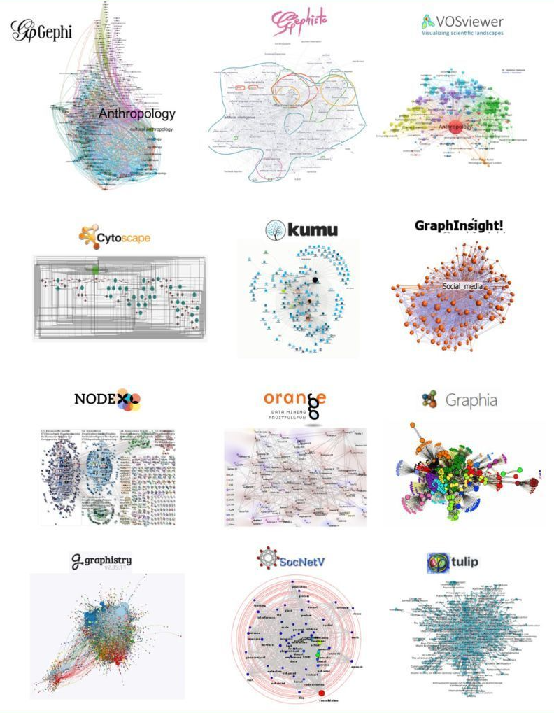

# Packages

𝐓𝐨𝐨𝐥𝐬 𝐭𝐨 𝐦𝐚𝐢𝐧𝐥𝐲 𝐯𝐢𝐬𝐮𝐚𝐥𝐢𝐳𝐞 𝐧𝐞𝐭𝐰𝐨𝐫𝐤𝐬:
- Geph - https://gephi.org
- Gephisto- https://lnkd.in/diSp3BWN
- VOSviewer - https://www.vosviewer.com
- Cytoscape - https://cytoscape.org
- Kumu - https://kumu.io
- GraphInsight - https://lnkd.in/d5XnkWJr
- NodeXL - https://nodexl.com
- Orange - https://lnkd.in/dZU8Zx3D
- Graphia - https://graphia.app
- Graphistry - https://www.graphistry.com
- SocNetV - https://socnetv.org
- Tulip - https://lnkd.in/dtc_BD33

𝐍𝐞𝐭𝐰𝐨𝐫𝐤 𝐥𝐢𝐛𝐫𝐚𝐫𝐢𝐞𝐬 𝐢𝐧 𝐏𝐲𝐭𝐡𝐨𝐧:
- networkx - https://lnkd.in/dKCCXjif
- graphviz - https://lnkd.in/dtrTeqRv
- pydot - https://lnkd.in/dA46YZvy
- python-igraph - https://lnkd.in/dCGsRXh2
- pyvis - https://lnkd.in/dVrQ64nN
- ipycytoscape - https://lnkd.in/d-hJjDdG
- pygsp - https://lnkd.in/dS7s-A_v
- graph-tool - https://lnkd.in/dvytUzdu
- nxviz - https://lnkd.in/duHbKGPN
- py2cytoscape - https://lnkd.in/dWUU8TZH
- ipydagred3 - https://lnkd.in/diXgFWMD
- ipysigma - https://lnkd.in/dP55J5et
- Py3Plex - https://lnkd.in/dhwe7f_g
- net wulf - https://lnkd.in/dxrHAm2P

